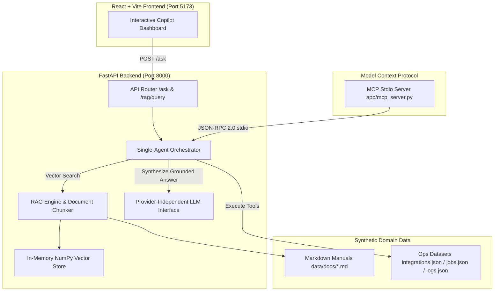

# IntegrationOps AI Copilot

> **Independent AI Engineering Portfolio Project**  
> *Demonstrating practical RAG architecture, single-agent orchestration, tool calling, and MCP server design for enterprise integration operations.*

---

## Project Overview

**IntegrationOps AI Copilot** is an independent, production-oriented portfolio project built to showcase practical expertise in applied AI engineering.

The copilot enables operations engineers to monitor synthetic integration flows, inspect job execution histories, diagnose failing data synchronization pipelines (`JOB-1001`), and search standard operating documentation using natural language queries.

---

## Problem Statement

Modern enterprise integration platforms process millions of batch and real-time records daily across SaaS platforms (Salesforce, ServiceNow, GitHub, Stripe). When an integration job fails (e.g. due to schema mismatches, network timeouts, or expired OAuth tokens):
- Engineers must manually check database tables, search raw log traces, and consult separate documentation manuals to diagnose the failure.
- Passive search engines cannot inspect live job execution states.
- Standard LLM chatbots tend to hallucinate when asked about internal system errors unless provided with real-time operational context.

**IntegrationOps AI Copilot** solves this by unifying **real-time operational tool execution** with **RAG document search** behind a grounded single-agent interface.

---

## Architecture Diagram



---

## Key Features

- **Provider-Independent LLM Layer**: Abstract `BaseLLMClient` supporting `OpenAILLMClient`, `GeminiLLMClient`, and zero-dependency `MockDevelopmentLLMClient` fallback.
- **RAG & Vector Search**: Section-aware Markdown chunker (`MarkdownChunker`) paired with a NumPy-powered in-memory vector store computing cosine similarity.
- **Single-Agent Tool Orchestration**: Deterministic entity router invoking operational tools (`get_job_status`, `get_job_logs`, `get_integration_config`, `get_pipeline_metrics`).
- **Hybrid RAG + Tool Context Synthesis**: Dynamically combines live system state observations with retrieved documentation guidance.
- **Model Context Protocol (MCP) Server**: Zero-dependency stdio server (`app/mcp_server.py`) exposing operational tools to external AI hosts (Claude Desktop, Antigravity, Cursor).
- **Automated RAG Evaluation Suite**: Pure-Python evaluation runner (`evaluation/eval_runner.py`) measuring document hit rates, concept coverage, faithfulness, and latency.

---

## Technologies Used

- **Backend**: Python 3.13, FastAPI, Pydantic v2, Pydantic Settings, Uvicorn, NumPy, HTTPX, Pytest.
- **Frontend**: React 18, Vite, Vanilla CSS (Dark Mode design system, responsive glassmorphism layout).
- **AI & RAG**: Vector Cosine Similarity (NumPy), Recursive Markdown Chunker, Custom LLM Provider Abstraction.
- **Protocol**: JSON-RPC 2.0 over `stdio` (Model Context Protocol).

---

## RAG Pipeline Details

The RAG pipeline maps synthetic documentation into searchable vectors:
1. **Markdown Loading**: Parses `.md` manuals in `backend/data/docs/`.
2. **Header-Aware Chunking**: `MarkdownChunker` splits text by Markdown headers (`#`, `##`) while preserving metadata (`document_name`, `section`, `chunk_index`).
3. **Local Embedding Generation**: Unit-normalized dense vectors ($\|\mathbf{v}\| = 1$).
4. **Vector Retrieval**: Computes cosine similarity scores:
   $$\text{Cosine Similarity} = \frac{\mathbf{u} \cdot \mathbf{v}}{\|\mathbf{u}\|_2 \|\mathbf{v}\|_2}$$
5. **Grounded Context Injection**: Assembles top-$K$ chunks with source headers into the system prompt, enforcing strict evidence rules.

---

## Agent Architecture & Tool Calling

The copilot uses a deterministic **Single-Agent Loop**:
```
User Question ──► Decision / Entity Detection ──► Tool & RAG Actions ──► Observations ──► Final Answer
```

### Exposed Operational Tools (`backend/app/agent/tools.py`)
- `get_job_status(job_id)`: Returns job state (`FAILED`, `SUCCESS`), failing service, error message, and timestamps.
- `get_job_logs(job_id)`: Fetches structured log traces (INFO, WARN, ERROR) for a job ID.
- `get_integration_config(integration_id)`: Returns source/destination systems, owner, and cron schedule.
- `get_pipeline_metrics(job_id)`: Calculates processed vs failed record counts and failure rate percentage ($\%$).

---

## Model Context Protocol (MCP) Design

The MCP server [`backend/app/mcp_server.py`](file:///C:/Users/kraje/.gemini/antigravity-ide/scratch/integrationops-ai/backend/app/mcp_server.py) exposes tools to any external MCP client using standard JSON-RPC 2.0 over `stdio`:

### Example JSON-RPC Tool Call Request
```json
{
  "jsonrpc": "2.0",
  "id": 1,
  "method": "tools/call",
  "params": {
    "name": "get_job_status",
    "arguments": { "job_id": "JOB-1001" }
  }
}
```

---

## Evaluation Benchmark Results

Evaluated via `evaluation/eval_runner.py` across 5 ground-truth ops benchmark questions:

| Metric | Measured Empirical Score |
|---|---|
| **Total Benchmark Questions** | **5** |
| **Mean Source Document Hit Rate** | **70.0%** |
| **Mean Faithfulness / Grounding Score** | **100.0%** |
| **Mean Pipeline Execution Latency** | **1.56 ms** |

---

## Example Questions & API Payloads

### Example 1: Combined Hybrid Query (`POST /ask`)

#### Request
```json
POST http://localhost:8000/ask
{
  "question": "Why did JOB-1001 fail and what should normally happen during publishing?"
}
```

#### Response
```json
{
  "answer": "Based on the operational system data and documentation:\n\nOperational System Data: Job JOB-1001 status is FAILED in service Publisher due to 'Destination validation failed: target table schema mismatch on column customer_email'. 120 records rejected.\n\nDocumentation Guidance: The Publisher component validates transformed payloads against target destination table definitions (such as PostgreSQL or BigQuery) and executes bulk upsert operations.",
  "sources": [
    {
      "document_name": "publishing.md",
      "section": "Schema Mismatch Errors",
      "source_path": "C:\\Users\\kraje\\.gemini\\antigravity-ide\\scratch\\integrationops-ai\\backend\\data\\docs\\publishing.md"
    }
  ],
  "tools_used": [
    "get_job_status",
    "get_job_logs"
  ]
}
```

### Example Questions to Try in UI:
- *What is the normal integration pipeline?* (RAG Document Search)
- *What happens during publishing?* (RAG Document Search)
- *Why did JOB-1001 fail?* (Operational Job Tools)
- *How many records failed in JOB-1005?* (Operational Job Metrics)
- *Why did JOB-1001 fail and what should normally happen during publishing?* (Hybrid RAG + Agent Demo)

---

## How to Run Locally

### 1. Backend Setup & Execution
```powershell
cd backend
python -m venv venv

# On Windows:
.\venv\Scripts\Activate.ps1
# On Linux/macOS:
source venv/bin/activate

pip install -r requirements.txt
uvicorn app.main:app --reload --port 8000
```
- **Backend API**: `http://localhost:8000`
- **Swagger Docs**: `http://localhost:8000/docs`

### 2. Frontend Setup & Execution
```powershell
cd frontend
npm install
npm run dev
```
- **React UI**: `http://localhost:5173`

### 3. Run Test Suite & Evaluation
```powershell
# Run Pytest (36 unit tests)
cd backend
.\venv\Scripts\python.exe -m pytest

# Run Evaluation Benchmark Runner
.\venv\Scripts\python.exe ..\evaluation\eval_runner.py
```

---

## Free-Tier Deployment Guide

The application is engineered for zero-cost deployment on free-tier container platforms:

1. **Backend Deployment (Render / Railway / HuggingFace Spaces)**:
   - Build container using standard Python 3.13 slim image.
   - Set environment variables: `PORT=8000`, `ENVIRONMENT=production`, `LLM_PROVIDER=mock`.
2. **Frontend Deployment (Vercel / Netlify / Cloudflare Pages)**:
   - Build output directory: `frontend/dist`.
   - Set build environment variable: `VITE_API_BASE_URL=https://your-backend-api.onrender.com`.

---

## System Limitations

1. **Synthetic In-Memory Datasets**: Uses JSON files and in-memory arrays rather than live relational database connections.
2. **Local Embedding Projection**: Uses an offline n-gram hash projection vector model rather than a GPU-hosted Transformer model.
3. **Static Rule-Based Evaluation**: Evaluation uses exact concept string matching rather than LLM-as-a-Judge semantic scoring.

---

## Future Improvements

- Migrate in-memory vector store to **PostgreSQL + `pgvector`**.
- Integrate **Hybrid Search** (Dense Vector + BM25 Lexical Keyword search with Reciprocal Rank Fusion).
- Implement **LLM-as-a-Judge** scoring (using Ragas framework) in CI/CD build pipelines.
- Expand React UI with real-time SSE streaming for agent tool traces.
